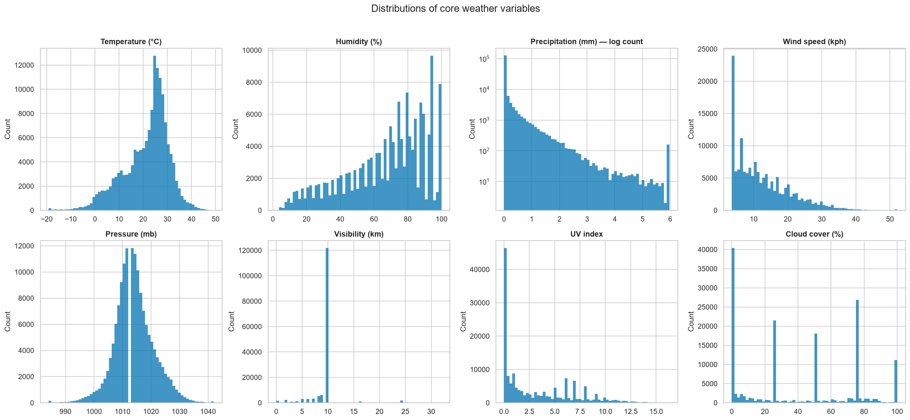
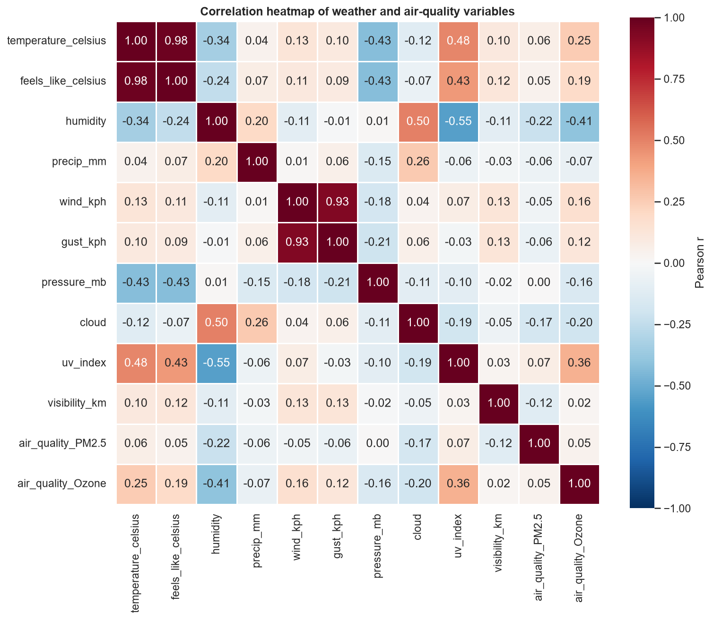
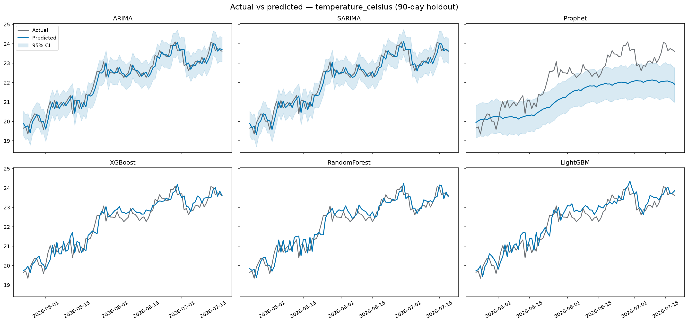
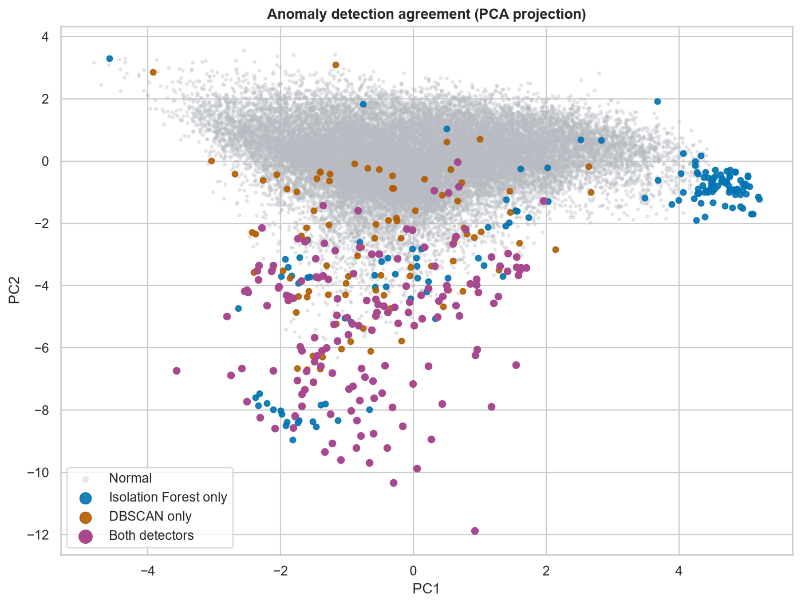
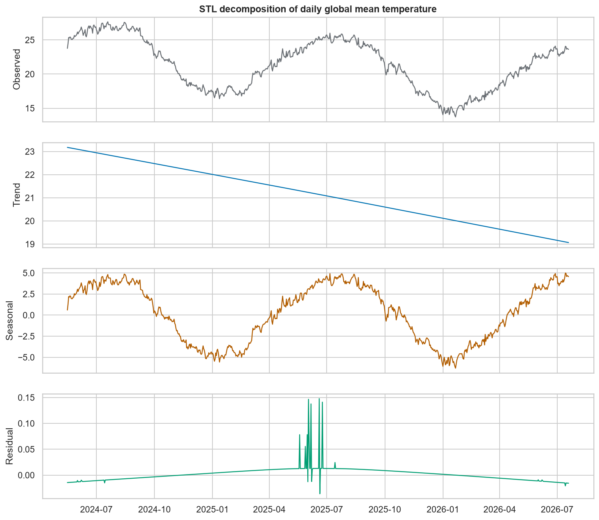
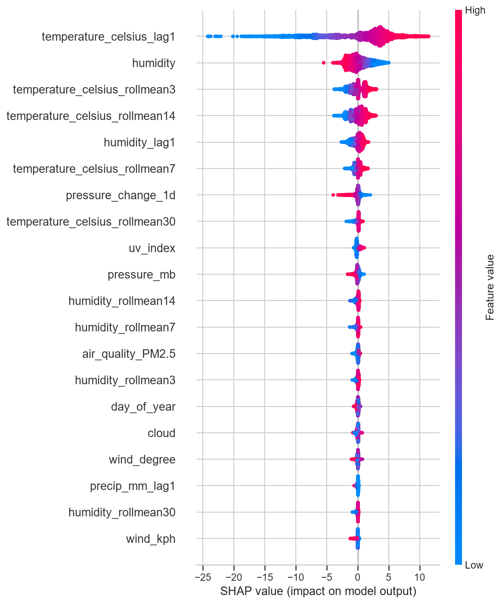

# 🌍 WeatherScope AI — Global Weather Trend Forecasting

An end-to-end, production-style data science project on the Kaggle
[Global Weather Repository](https://www.kaggle.com/datasets/nelgiriyewithana/global-weather-repository):
**154 k observations, 200+ countries, 40+ weather and air-quality features**,
turned into a reproducible pipeline, six forecasting models, ensembles,
explainability, climate/air-quality/spatial analysis and an interactive
Streamlit dashboard.

---

## ✨ Features

- **Reusable cleaning pipeline** — validation against physical ranges,
  deduplication, per-location imputation, IQR winsorization with
  percentile guards (weather extremes survive; glitches don't), Isolation
  Forest multivariate outlier flagging, scaling + encoding.
- **Advanced EDA** — 17+ static and interactive figures: distributions,
  correlations, monthly/seasonal trends, country/continent comparisons,
  hottest/coldest city rankings.
- **Anomaly detection** — Isolation Forest vs DBSCAN on a shared feature
  space, agreement analysis in PCA projection and a data-driven
  explanation of *why* anomalies occur.
- **Forecasting** — ARIMA, SARIMA, Prophet, XGBoost, Random Forest and
  LightGBM on three targets (temperature, humidity, precipitation),
  evaluated with honest **rolling one-step-ahead** forecasts over a
  90-day holdout (MAE, RMSE, MAPE, R²) plus a Prophet 30-day outlook
  with 95 % intervals.
- **Ensembles** — voting, inverse-RMSE weighted averaging and Ridge
  stacking, blended and evaluated on disjoint windows.
- **Explainability** — Random Forest / XGBoost / permutation importance
  and SHAP (beeswarm, top-20 bar, dependence plot).
- **Climate analysis** — month-balanced yearly averages, seasonal shift
  curves, temperature anomalies vs day-of-year climatology, STL trend
  decomposition.
- **Air quality** — six pollutants, EPA AQI breakdown, weather
  correlations, wind-ventilation effect, city rankings.
- **Spatial analysis** — six interactive Folium maps (heatmaps,
  choropleth, PM2.5, KMeans weather clusters) + latitude/climate-zone
  effects.
- **Dashboard** — 8-page Streamlit app with country / city / date /
  forecast-horizon filters.
- **Auto-generated report** — every number in
  [`outputs/reports/REPORT.md`](outputs/reports/REPORT.md) comes from the
  latest pipeline run.

## 🏗️ Architecture

```
raw CSV ─▶ preprocessing ─▶ feature engineering ─▶ ┌ EDA
   (validate, dedupe,        (calendar, lags,      ├ anomaly detection
    winsorize, flag,          rolling, derived,    ├ forecasting ─▶ ensembles
    scale, encode)            wind categories)     ├ feature importance
                                                   ├ climate analysis
                                                   ├ air quality
                                                   └ spatial analysis
                                          all artifacts ─▶ report + dashboard
```

Every stage is a `run_*()` entry point in `src/`, orchestrated by
`main.py` and configured by `config.yaml` (paths, thresholds, model
hyper-parameters, targets). Stages communicate only through saved
artifacts, so each can be re-run independently.

## 📁 Folder Structure

```
weather-trend-forecasting/
├── data/
│   ├── raw/                  # GlobalWeatherRepository.csv (download below)
│   └── processed/            # clean / scaled / feature parquet artifacts
├── notebooks/                # exploratory walkthrough
├── src/
│   ├── utils.py              # config, logging, IO, metrics, palette
│   ├── preprocessing.py      # cleaning pipeline
│   ├── feature_engineering.py
│   ├── eda.py
│   ├── anomaly_detection.py
│   ├── forecasting.py
│   ├── ensemble.py
│   ├── feature_importance.py
│   ├── climate_analysis.py
│   ├── air_quality.py
│   ├── spatial_analysis.py
│   ├── dashboard.py          # Streamlit pages
│   └── report.py             # auto-generated REPORT.md
├── outputs/
│   ├── figures/              # PNG + interactive HTML (+ maps/)
│   ├── models/               # fitted models, predictions, forecasts
│   └── reports/              # REPORT.md, metrics & summaries (JSON/CSV)
├── app.py                    # streamlit run app.py
├── main.py                   # python main.py --stage all
├── config.yaml
└── requirements.txt
```

## 🚀 Installation

```bash
git clone <repo-url> && cd weather-trend-forecasting
python -m venv .venv
.venv\Scripts\activate            # Windows  (source .venv/bin/activate on Unix)
pip install -r requirements.txt

# dataset (public, ~40 MB)
curl -L -o gwr.zip "https://www.kaggle.com/api/v1/datasets/download/nelgiriyewithana/global-weather-repository"
tar -xf gwr.zip -C data/raw && del gwr.zip
```

## ⚙️ Usage

```bash
python main.py --stage all        # full pipeline (≈ 5 minutes)
python main.py --stage preprocess features   # any subset, in order
python main.py --list             # show available stages
streamlit run app.py              # dashboard
```

## 📸 Screenshots

| | |
|---|---|
|  |  |
|  |  |
|  |  |

Interactive Folium maps live in `outputs/figures/maps/` and inside the
dashboard's **Maps** page.

## 📊 Results & Model Performance

One-step-ahead evaluation on a 90-day holdout (global daily means):

| Target | Best model | MAE | RMSE | R² |
|---|---|---|---|---|
| Temperature (°C) | ARIMA | 0.249 | 0.321 | **0.936** |
| Humidity (%) | SARIMA | 0.957 | 1.207 | 0.261 |
| Precipitation (mm) | ARIMA | 0.024 | 0.031 | 0.010 |

- **Temperature** is highly predictable — strong day-to-day persistence
  plus seasonal structure; the inverse-RMSE **weighted ensemble** beats
  every individual model on the evaluation window.
- **Humidity** carries moderate signal; **globally averaged
  precipitation** is near white noise (spatial averaging cancels local
  rain events) — an honest negative result, quantified.
- Full tables per target and ensemble comparisons:
  [`outputs/reports/REPORT.md`](outputs/reports/REPORT.md).

## 🖥️ Dashboard

`streamlit run app.py` → 8 pages: Overview, EDA, Forecasting (holdout +
30-day Prophet outlook with CI), Maps, Feature Importance, Climate
Analysis, Air Quality, Model Comparison — all filterable by country,
city, date range and forecast horizon.

## 🎬 Demo

The dashboard is the demo: launch it and walk Overview → Forecasting →
Maps in under two minutes. *(Demo video link: to be added.)*

## 🔮 Future Improvements

- Hierarchical / global neural forecasters (N-BEATS, TFT) for per-city
  prediction at scale.
- Exogenous drivers (pressure tendencies, teleconnection indices).
- Probabilistic scoring (CRPS) and conformal prediction intervals.
- Scheduled retraining on live WeatherAPI data.

## 📚 References

- [Global Weather Repository (Kaggle)](https://www.kaggle.com/datasets/nelgiriyewithana/global-weather-repository)
- Hyndman & Athanasopoulos, *Forecasting: Principles and Practice*
- [Prophet documentation](https://facebook.github.io/prophet/)
- Lundberg & Lee (2017), *A Unified Approach to Interpreting Model
  Predictions* (SHAP)
- [statsmodels](https://www.statsmodels.org/) · [scikit-learn](https://scikit-learn.org/) · [Streamlit](https://streamlit.io/) · [Folium](https://python-visualization.github.io/folium/)
